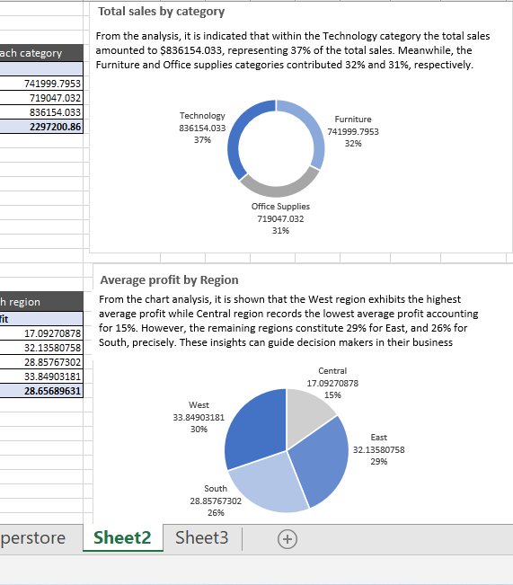
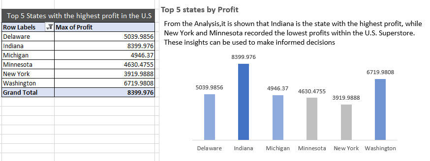
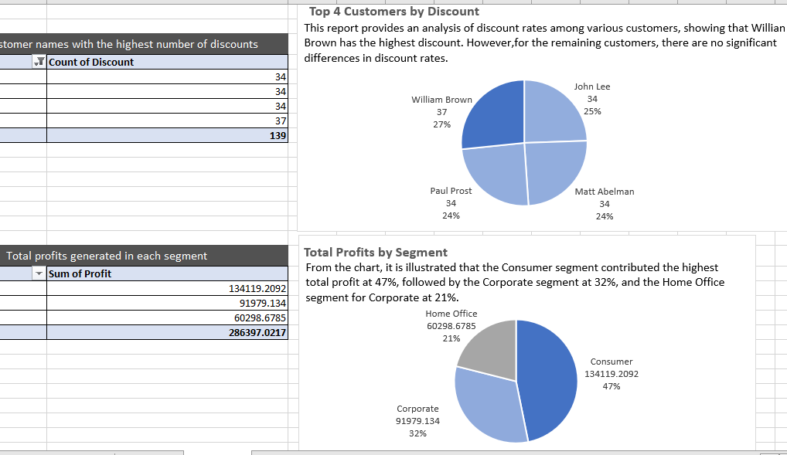
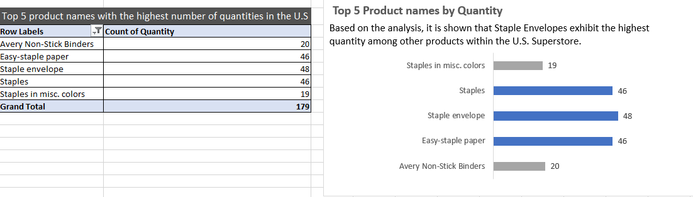

# Project on Data cleaning, Analysis, and Visualiztaion

### Introduction:
The U.S. Superstore dataset serves as a valuable resource for addressing six key business questions. This analysis focuses on the cleaning, analysis, and visualization of data, intending to have valuable insights into the U.S. Superstore. This analysis will give an understanding of the store's performance and opportunities for optimization and growth.

### Problem Statement:

Using the dataset, the 6 key questions generated were;
- The total values of sales for furniture, Office suppliers, and Technology.
- The average profit for each region.
- The top 5 states with the highest profit in the U.S
- The top 4 customer names with the highest number of discounts. 
- The total profits generated in consumer, corporate, and home office segments. 
- The top 5 product names with the highest number of quantities in the U.S. Superstore.

- ### Result/Discussion:

- 

The snapshot above shows an analysis of total sales by category and average profit by region. The result includes:

###  Total Sales by Category

##### Technology Category:
Total Sales: $836,154.033

Percentage of Total Sales: 37%

##### Furniture Category:
Total Sales: $741,999.7953

Percentage of Total Sales: 32%

##### Office Supplies Category:
Total Sales: $719,047.032

Percentage of Total Sales: 31%

### Average Profit by Region:

##### West Region:
Average Profit: $33.84903181

Percentage of Total Profit: 30%

##### East Region:
Average Profit: $32.13580758

Percentage of Total Profit: 29%

##### South Region:
Average Profit: $28.85767302

Percentage of Total Profit: 26%

##### Central Region:
Average Profit: $17.09270878

Percentage of Total Profit: 15%

This report provides a clear overview of the total sales by category and average profit by region, highlighting the significant contributions of the Technology category and the West Region.  These insights are be valuable for making informed business decisions.

The above snapshot provides the analysis of profitability by state and the following results show the performance of various states: 

Indiana emerges as the state with the highest recorded profit, totaling $8,399.976. This indicates strong business performance in Indiana. 

Washington is the second-highest profit-generating state, with a total profit of $6,719.9808.

Delaware ranks third in terms of profitability, with a total profit of $5,039.9856. 
Michigan has a total profit of $4,946.37.

Minnesota's profit has a $4,630.4755 and New York stands at profit of $3,919.9888.

These analyses are valuable for strategic decision-making.

The analysis has identified the top 4 customers by discount and analyzed the total profits by segment. The result includes;

##### Top 4 Customers by Discount:

William Brown stands out as the customer with the highest number of discounts, totaling 37 and constituting 27% of the total discounts
While John Lee, Paul Prost, and Matt Abelman have the same number of discounts, totaling 34 discounts, and constituting 25% of the total discounts, respectively. 

Additionally, the total Profits by Segment includes the following:

##### Consumer Segment: 
The consumer segment has generated the highest total profits, amounting to $134,119.2092 and representing 47% of the total.

##### Corporate Segment: 
The corporate segment follows closely with total profits of $91,979.134, making up 32% of the total profits.

##### Home Office Segment: 
The home office segment has generated a lower total profit of $60,298.6785, accounting for 21% of the total.

Understanding the top customers by discount and the profitability of different segments is crucial for strategic decision making.

The chart reveals the quantities of various products with a focus on the top-ranking items and the following products have been identified as the top 5 by quantity: 

- Staple Envelop: 48 units
- Staples: 46 units
- Easy-Staple Paper: 46 units
- Avery Non-Stick Binders: 20 units
- Staples in Miscellaneous Colors: 19 units

The chart provides valuable insights into product quantities, helping by making informed decisions regarding the products. Staple Envelop, Staples, and Easy-Staple Paper are the top three products by quantity, this suggests that there is an increasing demand for the products among customers.

### Conclusion:
the analysis conducted using the U.S. superstore dataset has valuable insights. From analyzing the total sales values across furniture, office supplies, and technology categories to calculating the average profits across different regions, highlighting the top 5 states with the highest profits, and the top 4 customers who received the most discounts, analyzing the total profits generated in consumer, corporate, and home office segments, and finally, determining the top 5 product names with the highest quantities sold; These analyses serve as a crucial means for making informed decisions, and enhancing profitability in various aspects of the business within the U.S. Superstores.
